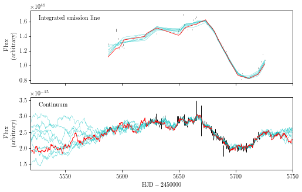

# cappuccino - CARAMEL post-processing code

Cappuccino is a package to handle post-processing and analysis of [CARAMEL](https://github.com/tommasotreu/caramel) output files. The name is a work-in-progress backronym for **CA**RAMEL <b>P</b>ost-<b>P</b>rocessing.....**UCCINO**.

It started off as a hodgepodge of python scripts, but as I started working with more and more CARAMEL runs, I decided to package it all up to work more nicely with my Jupyter Notebook based workflow.

Below is a brief guide on how to get started with cappuccino and some of the things you can do with it.

# Importing packages
First, make sure you've added cappuccino to your Python path. You can do this in your .bashrc file with, e.g., `export PYTHONPATH=$PYTHONPATH:/Users/peterwilliams/Documents/revmap/code/cappuccino`


```python
import numpy as np
import matplotlib.pyplot as plt
import astropy.io.fits as fits
import glob

from cappuccino import model
from cappuccino.plotting import buildFigures as bf
from cappuccino.plotting import display, posteriors, transfer
#from cappuccino.plotting import display, transfer, geometries, cornerPlot
from cappuccino.utils import parInfo

texnames = parInfo.paramTexNames()
texunits = parInfo.paramTexUnits()
```

# Creating the Model object

The main class in cappuccino is the model.Model class. This contains all of the functions for processing the CARAMEL output files and is used to interface with many of the other functions in cappuccino. When you create the object there are some properties that you **MUST** make sure match the values you used for your CARAMEL run:
- `backward_extrap`: Same as `Constants::continuumExtrapolationBack` in Constants.cpp
- `forward_extrap`: Same as `Constants::continuumExtrapolationFront` in Constants.cpp
- `CARAMEL_params_list`: Same as the parameters output by the version of CARAMEL you're using. You can find this by looking at the values printed by the `RMModel::print()` function. By default, it's equal to the current master branch.
- `nhyperparams`: Number of hyperparameters in the CARAMEL continuum model. By default, it's equal to the current master branch.

Some other values you'll want to set are:
- `redshift`: Redshift of the AGN. This is needed for redshift-correcting parameters such as the black hole mass, BLR size, etc.
- `fp_run`: Path to the CARAMEL run and its files. 
- `data_filenames`: Dictionary with the filenames of the four CARAMEL input data files. If not provided, the code will attempt to find them and will throw an error if it's unable to determine which files are which.

I like to store all of this information in a dictionary so I can easily pass it in as kwargs when creating the Model instance. You can set that here directly or save it in a .json file and load it in.


```python
import json
with open("/Users/peterwilliams/Documents/revmap/code/cappuccino/example_data/run_info.json") as f:
    run_info = json.load(f)
#import pprint
#pprint.pprint(run_info)
```

Next, you can create the Model object by passing in the dictionary as kwargs and run, e.g., postprocess.py and convergence.py. If you've saved the cut and temperature values in run_info, they'll automatically be passed along. Alternatively you can specify them in the calls to the individual functions.


```python
reload(model)
# Create the model object
mrk50 = model.Model(**run_info['mrk50_light'])

# Run postprocess.py
mrk50.postprocess()

# Run convergence.py
mrk50.convergence()
```

    Loading CARAMEL input data files...
      spectra: /Volumes/cortado/revmap/code/cappuccino/example_data/CARAMEL_runs/mrk50_light/Data/mrk50_csub-kov_hbeta_spectra_rescaled.txt
      continuum: /Volumes/cortado/revmap/code/cappuccino/example_data/CARAMEL_runs/mrk50_light/Data/mrk50_continuum_sec.txt
      times: /Volumes/cortado/revmap/code/cappuccino/example_data/CARAMEL_runs/mrk50_light/Data/mrk50_hbeta_times_sec.txt
    
    Are you sure you want to overwrite posterior_sample files? (Y/N)n
    Skipping postprocess.py
    
    Running convergence.py with cut=0.10...


    /anaconda3/envs/astroconda/lib/python2.7/site-packages/matplotlib/cbook/deprecation.py:107: MatplotlibDeprecationWarning: Adding an axes using the same arguments as a previous axes currently reuses the earlier instance.  In a future version, a new instance will always be created and returned.  Meanwhile, this warning can be suppressed, and the future behavior ensured, by passing a unique label to each axes instance.
      warnings.warn(message, mplDeprecation, stacklevel=1)


    log10(Mbh/Msun) = 7.68646629442 += 0.248493973454
    Opening angle (deg) = 13.1950531645 += 5.01436092564
    Inclination angle (deg) = 16.5624769725 += 5.51782966925
    Mean radius (light days) = 8.28650480052 += 0.515442172358


If you've already created the posterior_sample files, you can load them in directly.


```python
mrk50 = model.Model(load_posterior=True, **run_info['mrk50_light'])
```

    Loading CARAMEL input data files...
      spectra: /Volumes/cortado/revmap/code/cappuccino/example_data/CARAMEL_runs/mrk50_light/Data/mrk50_csub-kov_hbeta_spectra_rescaled.txt
      continuum: /Volumes/cortado/revmap/code/cappuccino/example_data/CARAMEL_runs/mrk50_light/Data/mrk50_continuum_sec.txt
      times: /Volumes/cortado/revmap/code/cappuccino/example_data/CARAMEL_runs/mrk50_light/Data/mrk50_hbeta_times_sec.txt
    
    Loading posterior_sample file: /Volumes/cortado/revmap/code/cappuccino/example_data/CARAMEL_runs/mrk50_light/posterior_sample.npy
    
    4719 items in posterior sample
          log10Mbh      Rmin   Rmedian  Taumedian     Thetai     Thetao      Beta  \
    mean  7.676272  0.687887  6.634512   5.902271  16.562477  13.195053  0.800887   
    50%   7.647150  0.578181  6.612474   5.887820  16.101260  12.247775  0.789672   
    std   0.248520  0.529740  0.547437   0.470420   5.518414   5.014892  0.104339   
    
             Gamma     Kappa        Xi     Fflow    Fellip  
    mean  1.599563 -0.024486  0.407184  0.752048  0.329878  
    50%   1.622440 -0.036521  0.422421  0.752685  0.332561  
    std   0.258724  0.142138  0.135366  0.145645  0.084202  


Or load in directly from the JSON file


```python
reload(model)
mrk50 = model.Model.fromJSON(
    "/Users/peterwilliams/Documents/revmap/code/cappuccino/example_data/run_info.json",
    'mrk50_light',
    load_posterior=True
)
```

    Creating model using the following:
      forward_extrap: 0.1
      cut: 0.1
      description: Markarian 50, CARAMEL-light
      temp: 150
      redshift: 0.0237
      backward_extrap: 0.5
      CARAMEL_params_list: [u'Mbh', u'mu', u'Beta', u'F', u'Thetao', u'Thetai', u'Kappa', u'Xi', u'Gamma', u'Cadd', u'Cmult', u'Fellip', u'Fflow', u'angular_sd_orbiting', u'radial_sd_orbiting', u'angular_sd_flowing', u'radial_sd_flowing', u'Sigmaturb', u'Thetae', u'narrow_line_flux', u'Blurring', u'Rmean', u'Rmedian', u'Taumean', u'Taumedian', u'NarrowLineCenter']
      fp_run: /Volumes/cortado/revmap/code/cappuccino/example_data/CARAMEL_runs/mrk50_light/
      data_filenames: {u'spectra': u'mrk50_csub-kov_hbeta_spectra_rescaled.txt', u'sigma': u'mrk50_csub-kov_sigma_sec.txt', u'continuum': u'mrk50_continuum_sec.txt', u'spectra_times': u'mrk50_hbeta_times_sec.txt'}
      runname: ${\rm Mrk~50~{\sc light}}$
      linecenter: 4861.33
    Loading CARAMEL input data files...
      spectra: /Volumes/cortado/revmap/code/cappuccino/example_data/CARAMEL_runs/mrk50_light/Data/mrk50_csub-kov_hbeta_spectra_rescaled.txt
      continuum: /Volumes/cortado/revmap/code/cappuccino/example_data/CARAMEL_runs/mrk50_light/Data/mrk50_continuum_sec.txt
      times: /Volumes/cortado/revmap/code/cappuccino/example_data/CARAMEL_runs/mrk50_light/Data/mrk50_hbeta_times_sec.txt
    
    Loading posterior_sample file: /Volumes/cortado/revmap/code/cappuccino/example_data/CARAMEL_runs/mrk50_light/posterior_sample.npy
    
    4719 items in posterior sample
          log10Mbh      Rmin   Rmedian  Taumedian     Thetai     Thetao      Beta  \
    mean  7.676272  0.687887  6.634512   5.902271  16.562477  13.195053  0.800887   
    50%   7.647150  0.578181  6.612474   5.887820  16.101260  12.247775  0.789672   
    std   0.248520  0.529740  0.547437   0.470420   5.518414   5.014892  0.104339   
    
             Gamma     Kappa        Xi     Fflow    Fellip  
    mean  1.599563 -0.024486  0.407184  0.752048  0.329878  
    50%   1.622440 -0.036521  0.422421  0.752685  0.332561  
    std   0.258724  0.142138  0.135366  0.145645  0.084202  


At this point, you can easily access useful information such as:
- Posterior sample DataFrame -- e.g., mrk50.posterior
- Confidence intervals -- mrk50.confints
- Input spectra -- mrk50.data
- Input spectra uncertainties -- mrk50.err
- Input spectra times -- mrk50.times
- Input continuum light curve -- mrk50.cont


```python
mrk50.posterior.head()
#mrk50.confints
```


<div>
<style scoped>
    .dataframe tbody tr th:only-of-type {
        vertical-align: middle;
    }

    .dataframe tbody tr th {
        vertical-align: top;
    }

    .dataframe thead th {
        text-align: right;
    }
</style>
<table border="1" class="dataframe">
  <thead>
    <tr style="text-align: right;">
      <th></th>
      <th>Rmin</th>
      <th>radial_sd_flowing</th>
      <th>Blurring</th>
      <th>radial_sd_orbiting</th>
      <th>Fflow</th>
      <th>Sigmar_numeric</th>
      <th>Kappa</th>
      <th>Rmean</th>
      <th>Taumean</th>
      <th>narrow_line_flux</th>
      <th>...</th>
      <th>Taumedian</th>
      <th>Fellip</th>
      <th>Sigmaturb</th>
      <th>Gamma</th>
      <th>Xi</th>
      <th>Mbh</th>
      <th>mu</th>
      <th>Cadd</th>
      <th>Sigmar</th>
      <th>angular_sd_orbiting</th>
    </tr>
  </thead>
  <tbody>
    <tr>
      <th>0</th>
      <td>1.585341</td>
      <td>0.001562</td>
      <td>1.515590</td>
      <td>0.005754</td>
      <td>0.838490</td>
      <td>7.200917</td>
      <td>0.315565</td>
      <td>9.305344</td>
      <td>8.590740</td>
      <td>2.101150e+39</td>
      <td>...</td>
      <td>6.646528</td>
      <td>0.428240</td>
      <td>0.002011</td>
      <td>1.98116</td>
      <td>0.415278</td>
      <td>1.020753e+08</td>
      <td>9.550592</td>
      <td>-1.219920e-15</td>
      <td>7.390702</td>
      <td>0.020862</td>
    </tr>
    <tr>
      <th>1</th>
      <td>0.189823</td>
      <td>0.006247</td>
      <td>2.654780</td>
      <td>0.002432</td>
      <td>0.988562</td>
      <td>5.626582</td>
      <td>0.044064</td>
      <td>7.579552</td>
      <td>7.173405</td>
      <td>3.686480e+39</td>
      <td>...</td>
      <td>5.725464</td>
      <td>0.205555</td>
      <td>0.007952</td>
      <td>1.52032</td>
      <td>0.549332</td>
      <td>4.121962e+07</td>
      <td>7.594599</td>
      <td>-1.178020e-15</td>
      <td>5.637752</td>
      <td>0.012286</td>
    </tr>
    <tr>
      <th>2</th>
      <td>0.087404</td>
      <td>0.003984</td>
      <td>2.300550</td>
      <td>0.002328</td>
      <td>0.731994</td>
      <td>6.935505</td>
      <td>-0.028978</td>
      <td>8.678890</td>
      <td>7.902457</td>
      <td>2.864910e+39</td>
      <td>...</td>
      <td>6.302449</td>
      <td>0.453392</td>
      <td>0.002976</td>
      <td>1.34165</td>
      <td>0.010160</td>
      <td>1.123467e+08</td>
      <td>8.807869</td>
      <td>-1.256200e-15</td>
      <td>7.038575</td>
      <td>0.008728</td>
    </tr>
    <tr>
      <th>3</th>
      <td>0.247261</td>
      <td>0.002119</td>
      <td>0.610107</td>
      <td>0.073849</td>
      <td>0.736030</td>
      <td>6.419137</td>
      <td>-0.210026</td>
      <td>7.981008</td>
      <td>7.425022</td>
      <td>2.891670e+39</td>
      <td>...</td>
      <td>5.853992</td>
      <td>0.268332</td>
      <td>0.015000</td>
      <td>1.13801</td>
      <td>0.278431</td>
      <td>4.279404e+07</td>
      <td>7.905205</td>
      <td>-1.172720e-15</td>
      <td>6.358169</td>
      <td>0.024607</td>
    </tr>
    <tr>
      <th>4</th>
      <td>0.321360</td>
      <td>0.007469</td>
      <td>3.096510</td>
      <td>0.001071</td>
      <td>0.997131</td>
      <td>5.323847</td>
      <td>0.053539</td>
      <td>7.832909</td>
      <td>7.214977</td>
      <td>4.454710e+39</td>
      <td>...</td>
      <td>5.732349</td>
      <td>0.412686</td>
      <td>0.024053</td>
      <td>1.97171</td>
      <td>0.544206</td>
      <td>3.619379e+07</td>
      <td>7.937638</td>
      <td>-1.143040e-15</td>
      <td>5.395029</td>
      <td>0.018991</td>
    </tr>
  </tbody>
</table>
<p>5 rows × 30 columns</p>
</div>


# Plotting functions
Below are a number of useful plotting functions. The first is the "display" plot which shows the time series of spectra, (one example) model fit to the data, normalized residual, example spectrum, integrated light curve, and continuum light curve. Some useful arguments:
- normalized = False will show the regular residual
- scale_by_temp will plot uncertainties multiplied by sqrt(T)
- lc_stype = 'samples' or 'confint' 


```python
reload(display)

display.plotDisplay(
    mrk50,
    scale_by_temp=False,
    lc_style='confint',
    emission_line_texname = "${\\rm Integrated~H}\\beta$",
    times_correct = -2450000.,
    plotstartdate=2455500,
    plotenddate=2455750,
    figsize=(4,6)
)
plt.show()
```

    Assuming dates are in HJD. If not, please set 'xlabel' parameter.


If it's useful, you can plot each of these panels individually


```python
reload(display)

# Time series of spectra
display.plotData(mrk50, figsize=(6,2), colorbar=True)
plt.show()

# Model fit to the data. index controls which sample from the posterior is shown
display.plotModel(mrk50, index=10, figsize=(6,2))
plt.show()

# Normalized residual. Can plot regular residual with normalized=False
display.plotResidual(mrk50, index=10, figsize=(6,2), normalized=False)
plt.show()

# Example spectrum profile. 
# scale_by_temp will plot uncertainties by sqrt(T)
# lc_stype = 'samples' or 'confint'
display.plotLineProfile(mrk50, lc_style='confint', scale_by_temp=True, figsize=(6,2))
plt.show()

# Light curves
fig,ax = plt.subplots(2,1,figsize=(8,5), sharex=True)
times_correct = -2450000
plotstartdate, plotenddate = 5520-times_correct,5750-times_correct
display.plotLineLightCurve(mrk50, ax=ax[0], times_correct=times_correct, plotstartdate=plotstartdate, plotenddate=plotenddate, emission_line_texname="{\\rm Integrated~emission~line}")
display.plotContinuumLightCurve(mrk50, ax=ax[1], times_correct=times_correct, plotstartdate=plotstartdate, plotenddate=plotenddate)
ax[0].set_xlabel('')
```


    Assuming dates are in HJD. If not, please set 'xlabel' parameter.
    Assuming dates are in HJD. If not, please set 'xlabel' parameter.


    Text(0.5,0,'')





You can can plot the posterior distributions with posterior.plotPosteriors(). Useful arguments:
- params: list of parameters to plot
- logify: Plot some of these on a log scale
- _type: histograms or Gaussian kde

You can also call this directly on the model object with, e.g., mrk50.plotPosterior()


```python
reload(posteriors)

posteriors.plotPosteriors(mrk50, _type='hist')
# or
mrk50.plotPosterior(
    params=['log10Mbh','Thetao','Thetai','Sigmaturb'],
    logify={'Sigmaturb':True},
    _type='kde',
    figsize=(5,3)
)
```


If you have multiple posterior distributions that you'd like to compare, you can pass in a list:


```python
# Load in a second model fit
mrk50_gas = model.Model(load_posterior=True, **run_info['mrk50_gas'])

posteriors.plotPosteriors(
    [mrk50, mrk50_gas],
    confints=False,
)
plt.show()
```

    Loading CARAMEL input data files...
      spectra: /Volumes/cortado/revmap/code/cappuccino/example_data/CARAMEL_runs/mrk50_gas/Data/mrk50_csub-kov_hbeta_spectra_rescaled.txt
      continuum: /Volumes/cortado/revmap/code/cappuccino/example_data/CARAMEL_runs/mrk50_gas/Data/mrk50_continuum_sec.txt
      times: /Volumes/cortado/revmap/code/cappuccino/example_data/CARAMEL_runs/mrk50_gas/Data/mrk50_hbeta_times_sec.txt
    
    Loading posterior_sample file: /Volumes/cortado/revmap/code/cappuccino/example_data/CARAMEL_runs/mrk50_gas/posterior_sample.npy
    
    1824 items in posterior sample
          log10Mbh      Rmin   Rmedian  Taumedian     Thetai     Thetao      Beta  \
    mean  7.479814  0.447406  8.676606   5.615975  21.379848  17.456017  0.715211   
    50%   7.474070  0.353773  8.052927   5.624760  20.215899  15.625476  0.711856   
    std   0.206898  0.376500  1.789247   0.396847   6.194877   6.420771  0.073510   
    
             Gamma     Kappa        Xi     Fflow    Fellip  
    mean  1.639720 -0.097835  0.384591  0.757011  0.377533  
    50%   1.686390 -0.099905  0.402163  0.756066  0.376709  
    std   0.248128  0.107475  0.123809  0.146760  0.079767  


You can use the TransferFunction object to plot transfer functions. You first need to initialize the transfer function, which will load in a clouds file if provided. Then you can plot the 2d transfer function and other panels with plot2dTransfer(). This will automatically do all of the binning, integrating, etc.

Useful arguments:
- tMax: Maximum lag to plot
- xtype: Wavelength or velocity on x-axis
- linecenter: Emission line center -- required if using xtype = 'velocity'
- lagtype: Lower panels, list of 'mean', 'median', or 'int'
- measured_lags: If you have velocity-resolved lag measurements, you can over-plot these on the 'mean' or 'median' transfer function panels, and the model-computed lags in the same bins will also be shown


```python
reload(transfer)
# First initialize the transfer function object
tf = transfer.TransferFunction(redshift=mrk50_gas.redshift, fp_clouds=glob.glob(mrk50_gas.fp_run+'clouds/clouds_*.txt')[0])

# If you want to over-plot velocity-resolved lag measurements
measured_lags = {
    'frame':'rest',
    'bins': [
        [4730,4830],
        [4830,4900],
        [4900,4980]
    ],
    'lags': [
        [3,4,3],
        [10,4,3],
        [5,4,3],
    ]
}

# Plot the transfer function
tf.plotTransfer(
    linecenter=mrk50_gas.linecenter,
    xtype='velocity',
    lagtype=['int','mean'],
    tMax=30.,
    xlims=[-8500,8500],
    measured_lags=measured_lags,
    colorbar=True
)
```

    Computing 2d transfer function with 100 lag bins and 100 wavelength bins,
                (lamMin, lamMax) = (4719.9, 5002.1) Angstroms,
                (lagMin, lagMax) = (0, 30) days
    Computing the lag-integrated transfer function
    Computing the mean lag spectrum
    Computing the velocity-integrated transfer function


As with the other plotting functions, you can show each of these panels on their own


```python
reload(transfer)

# First initialize the transfer function object
tf = transfer.TransferFunction(redshift=mrk50_gas.redshift, fp_clouds=glob.glob(mrk50_gas.fp_run+'clouds/clouds_*.txt')[0])

# 2d transfer function
tf.plot2dTransfer(
    linecenter=mrk50_gas.linecenter,
    xtype='wavelength',
    tMax=40.,
    colorbar=True
)

# Velocity- and lag-integrated transfer functions
tf.plotVelocityIntegrated(figsize=(6,2),sideways=False)
tf.plotLagIntegrated(xtype='velocity',linecenter=mrk50_gas.linecenter,figsize=(6,2))

# Lag-mean and Lag-median, with measured lags overplotted
fig,ax = plt.subplots(2,1,figsize=(4,2),sharex=True)
tf.plotLagMean(
    ax=ax[0],
    xtype='wavelength',
    lagtype='mean',
    linecenter=mrk50_gas.linecenter,
    measured_lags=measured_lags
)
tf.plotLagMean(
    ax=ax[1],
    xtype='wavelength',
    lagtype='median',
    linecenter=mrk50_gas.linecenter,
)
ax[0].set_xlabel('')
plt.show()
```

    Computing 2d transfer function with 100 lag bins and 100 wavelength bins,
                (lamMin, lamMax) = (4719.9, 5002.1) Angstroms,
                (lagMin, lagMax) = (0, 35) days
    Computing the velocity-integrated transfer function
    Computing the lag-integrated transfer function
    Computing the mean lag spectrum
    Computing the median lag spectrum


If you want to plot several transfer functions in one panel, the plotMultiple function will do this automatically for you. Here, I'm plotting several possible transfer functions for one of the CARAMEL runs.


```python
reload(transfer)
transfer.plotMultiple(
    tf_list = glob.glob(mrk50_gas.fp_run+'clouds/clouds_*.txt')[0:9],
    redshift = mrk50_gas.redshift,
    linecenter = mrk50_gas.linecenter,
    lagtype = ['int','mean'],
    measured_lags=measured_lags,
    xlims=[-6000,6000],
    figsize = (10,12),
    tMax=40.
)
```

    Loading clouds files and creating TransferFunction objects:
    Using file /Volumes/cortado/revmap/code/cappuccino/example_data/CARAMEL_runs/mrk50_gas/clouds/clouds_100.txt and redshift = 0.0237
    Using file /Volumes/cortado/revmap/code/cappuccino/example_data/CARAMEL_runs/mrk50_gas/clouds/clouds_1019.txt and redshift = 0.0237
    Using file /Volumes/cortado/revmap/code/cappuccino/example_data/CARAMEL_runs/mrk50_gas/clouds/clouds_1039.txt and redshift = 0.0237
    Using file /Volumes/cortado/revmap/code/cappuccino/example_data/CARAMEL_runs/mrk50_gas/clouds/clouds_1088.txt and redshift = 0.0237
    Using file /Volumes/cortado/revmap/code/cappuccino/example_data/CARAMEL_runs/mrk50_gas/clouds/clouds_1145.txt and redshift = 0.0237
    Using file /Volumes/cortado/revmap/code/cappuccino/example_data/CARAMEL_runs/mrk50_gas/clouds/clouds_1186.txt and redshift = 0.0237
    Using file /Volumes/cortado/revmap/code/cappuccino/example_data/CARAMEL_runs/mrk50_gas/clouds/clouds_132.txt and redshift = 0.0237
    Using file /Volumes/cortado/revmap/code/cappuccino/example_data/CARAMEL_runs/mrk50_gas/clouds/clouds_1331.txt and redshift = 0.0237
    Using file /Volumes/cortado/revmap/code/cappuccino/example_data/CARAMEL_runs/mrk50_gas/clouds/clouds_1397.txt and redshift = 0.0237
    Initializing empty 3x3 figure, size 10x12 inches.
    Computing 2d transfer function with 100 lag bins and 100 wavelength bins,
                (lamMin, lamMax) = (4719.9, 5002.1) Angstroms,
                (lagMin, lagMax) = (0, 40) days
    Computing the lag-integrated transfer function
    Computing the mean lag spectrum
    Computing the velocity-integrated transfer function
    Computing 2d transfer function with 100 lag bins and 100 wavelength bins,
                (lamMin, lamMax) = (4732.0, 5013.4) Angstroms,
                (lagMin, lagMax) = (0, 40) days
    Computing the lag-integrated transfer function
    Computing the mean lag spectrum
    Computing the velocity-integrated transfer function
    Computing 2d transfer function with 100 lag bins and 100 wavelength bins,
                (lamMin, lamMax) = (4632.8, 5230.6) Angstroms,
                (lagMin, lagMax) = (0, 40) days
    Computing the lag-integrated transfer function
    Computing the mean lag spectrum
    Computing the velocity-integrated transfer function
    Computing 2d transfer function with 100 lag bins and 100 wavelength bins,
                (lamMin, lamMax) = (4732.9, 4971.0) Angstroms,
                (lagMin, lagMax) = (0, 40) days
    Computing the lag-integrated transfer function
    Computing the mean lag spectrum
    Computing the velocity-integrated transfer function
    Computing 2d transfer function with 100 lag bins and 100 wavelength bins,
                (lamMin, lamMax) = (4699.7, 5072.2) Angstroms,
                (lagMin, lagMax) = (0, 40) days
    Computing the lag-integrated transfer function
    Computing the mean lag spectrum
    Computing the velocity-integrated transfer function
    Computing 2d transfer function with 100 lag bins and 100 wavelength bins,
                (lamMin, lamMax) = (4730.1, 4977.5) Angstroms,
                (lagMin, lagMax) = (0, 40) days
    Computing the lag-integrated transfer function
    Computing the mean lag spectrum
    Computing the velocity-integrated transfer function
    Computing 2d transfer function with 100 lag bins and 100 wavelength bins,
                (lamMin, lamMax) = (4747.4, 4976.3) Angstroms,
                (lagMin, lagMax) = (0, 40) days
    Computing the lag-integrated transfer function
    Computing the mean lag spectrum
    Computing the velocity-integrated transfer function
    Computing 2d transfer function with 100 lag bins and 100 wavelength bins,
                (lamMin, lamMax) = (4688.0, 5182.0) Angstroms,
                (lagMin, lagMax) = (0, 40) days
    Computing the lag-integrated transfer function
    Computing the mean lag spectrum
    Computing the velocity-integrated transfer function
    Computing 2d transfer function with 100 lag bins and 100 wavelength bins,
                (lamMin, lamMax) = (4721.2, 5013.6) Angstroms,
                (lagMin, lagMax) = (0, 40) days
    Computing the lag-integrated transfer function
    Computing the mean lag spectrum
    Computing the velocity-integrated transfer function


You can also combine multiple tranfer functions into one transfer function with uncertainties. You might want to do this to take, e.g., the average transfer function for a CARAMEL run.


```python
# Combine multiple transfer functions to compute the mean/median
reload(transfer)
tf_comb, tf_comb_sigma = transfer.combineTransfer(
    tf_list = glob.glob(mrk50_gas.fp_run+'clouds/clouds_*.txt')[0:], 
    _type = 'median',
    redshift = mrk50_gas.redshift,
    tMax = 35.,
    lamMin = 4700.,
    lamMax = 5020.,
    measured_lags=measured_lags
)

# Plot the combined transfer function, with uncertainties
tf_comb.plotTransfer(
    linecenter=mrk50_gas.linecenter,
    xtype='velocity',
    lagtype=['int','mean'],
    tMax=35.,
    measured_lags=measured_lags,
    xlims=[-8500,8500],
    colorbar=True,
    texname="${\\rm Combined,~median}$"
)

# Plot the uncertainty transfer function
tf_comb_sigma.plotTransfer(
    linecenter=mrk50_gas.linecenter,
    xtype='velocity',
    lagtype=['int','mean'],
    tMax=35.,
    xlims=[-8500,8500],
    colorbar=True,
    texname="${\\rm Combined,~std}$"
)
```

    Loading clouds files and creating TransferFunction objects, using redshift = 0.0237
    Combining 19 transfer functions using the median.
    Computing 2d transfer function with 100 lag bins and 100 wavelength bins,
                (lamMin, lamMax) = (4700.0, 5020.0) Angstroms,
                (lagMin, lagMax) = (0, 35) days
    Computing 2d transfer function with 100 lag bins and 100 wavelength bins,
                (lamMin, lamMax) = (4700.0, 5020.0) Angstroms,
                (lagMin, lagMax) = (0, 35) days
    Computing 2d transfer function with 100 lag bins and 100 wavelength bins,
                (lamMin, lamMax) = (4700.0, 5020.0) Angstroms,
                (lagMin, lagMax) = (0, 35) days
    Computing 2d transfer function with 100 lag bins and 100 wavelength bins,
                (lamMin, lamMax) = (4700.0, 5020.0) Angstroms,
                (lagMin, lagMax) = (0, 35) days
    Computing 2d transfer function with 100 lag bins and 100 wavelength bins,
                (lamMin, lamMax) = (4700.0, 5020.0) Angstroms,
                (lagMin, lagMax) = (0, 35) days
    Computing 2d transfer function with 100 lag bins and 100 wavelength bins,
                (lamMin, lamMax) = (4700.0, 5020.0) Angstroms,
                (lagMin, lagMax) = (0, 35) days
    Computing 2d transfer function with 100 lag bins and 100 wavelength bins,
                (lamMin, lamMax) = (4700.0, 5020.0) Angstroms,
                (lagMin, lagMax) = (0, 35) days
    Computing 2d transfer function with 100 lag bins and 100 wavelength bins,
                (lamMin, lamMax) = (4700.0, 5020.0) Angstroms,
                (lagMin, lagMax) = (0, 35) days
    Computing 2d transfer function with 100 lag bins and 100 wavelength bins,
                (lamMin, lamMax) = (4700.0, 5020.0) Angstroms,
                (lagMin, lagMax) = (0, 35) days
    Computing 2d transfer function with 100 lag bins and 100 wavelength bins,
                (lamMin, lamMax) = (4700.0, 5020.0) Angstroms,
                (lagMin, lagMax) = (0, 35) days
    Computing 2d transfer function with 100 lag bins and 100 wavelength bins,
                (lamMin, lamMax) = (4700.0, 5020.0) Angstroms,
                (lagMin, lagMax) = (0, 35) days
    Computing 2d transfer function with 100 lag bins and 100 wavelength bins,
                (lamMin, lamMax) = (4700.0, 5020.0) Angstroms,
                (lagMin, lagMax) = (0, 35) days
    Computing 2d transfer function with 100 lag bins and 100 wavelength bins,
                (lamMin, lamMax) = (4700.0, 5020.0) Angstroms,
                (lagMin, lagMax) = (0, 35) days
    Computing 2d transfer function with 100 lag bins and 100 wavelength bins,
                (lamMin, lamMax) = (4700.0, 5020.0) Angstroms,
                (lagMin, lagMax) = (0, 35) days
    Computing 2d transfer function with 100 lag bins and 100 wavelength bins,
                (lamMin, lamMax) = (4700.0, 5020.0) Angstroms,
                (lagMin, lagMax) = (0, 35) days
    Computing 2d transfer function with 100 lag bins and 100 wavelength bins,
                (lamMin, lamMax) = (4700.0, 5020.0) Angstroms,
                (lagMin, lagMax) = (0, 35) days
    Computing 2d transfer function with 100 lag bins and 100 wavelength bins,
                (lamMin, lamMax) = (4700.0, 5020.0) Angstroms,
                (lagMin, lagMax) = (0, 35) days
    Computing 2d transfer function with 100 lag bins and 100 wavelength bins,
                (lamMin, lamMax) = (4700.0, 5020.0) Angstroms,
                (lagMin, lagMax) = (0, 35) days
    Computing 2d transfer function with 100 lag bins and 100 wavelength bins,
                (lamMin, lamMax) = (4700.0, 5020.0) Angstroms,
                (lagMin, lagMax) = (0, 35) days


# Useful calculations
There are a number of useful calculations you might want to make based on the modeling results, such as computing the scale factor or the inflow-outflow parameter defined in Williams et al. (2018). A number of these are built in.

For calculations that take in other measurements, such as CCF lags or emission line widths, you first need set these values in the Model object. You can do this with "setParam()," where the first argument is the name of the parameter and the second argument is a length 3 list with the \[median, lower uncertainty, upper uncertainty\].

When propagating uncertainties in the calculations, the code will use the full posterior distributions for the CARAMEL model parameters, and will assume Gaussian uncertainties on the setParam values, using the mean of the upper and lower uncertainties.

Some example calculations are shown below


```python
# Need to set some measurements first
mrk50.setParam('Tauccf',[8.66,1.63,1.51])
mrk50.setParam('dvmeanfwhm',[4101.,56.,56.])
mrk50.setParam('dvmeansigma',[2024.,31.,31.])
mrk50.setParam('dvrmsfwhm',[1200.,100.,200.])
mrk50.setParam('dvrmssigma',[2020.,103.,103.])

# Compute log10L5100 based on the AGN distance and measured f5100l:
mrk50.setParam('f5100l',[1.2,0.2,0.2])
mrk50.setParam('DLMpc',[102.5,0.,0.])
mrk50.calcLog10LWave(wave=5100)
# Or set directly if already measured
#mrk50.setParam('log10L5100',[12.,3.,2.])

# Some useful calculations
mrk50.calcVirialProduct()
mrk50.calcF()
mrk50.calcLBol()
mrk50.calcLEdd()
mrk50.calcInflowOutflow()

mrk50.posterior[['log10f_meanfwhm','log10f_meansigma','log10f_rmsfwhm','log10f_rmssigma','loverlEdd','inflowoutflow']].describe()
```

    Calculating log10L5100 from f5100l and DLMpc
    
    Calculating virial products, using veltype = ['meanfwhm', 'meansigma', 'rmssigma', 'rmsfwhm']
    -Using lag (days) = 8.66 +1.51/-1.63
    -Using meanfwhm (km/s) = 4101.00 +56.00/-56.00
    -Using meansigma (km/s) = 2024.00 +31.00/-31.00
    -Using rmssigma (km/s) = 2020.00 +103.00/-103.00
    -Using rmsfwhm (km/s) = 1200.00 +200.00/-100.00
    
    Calculating scale factors, using veltype = ['meanfwhm', 'meansigma', 'rmssigma', 'rmsfwhm']
    
    Calculating bolometric luminosity with wavelength = 5100 Angstroms, bolometric correction = 9.0
    
    Calculating Eddington ratio
    
    Calculating inflow-outflow parameter
    


<div>
<style scoped>
    .dataframe tbody tr th:only-of-type {
        vertical-align: middle;
    }

    .dataframe tbody tr th {
        vertical-align: top;
    }

    .dataframe thead th {
        text-align: right;
    }
</style>
<table border="1" class="dataframe">
  <thead>
    <tr style="text-align: right;">
      <th></th>
      <th>log10f_meanfwhm</th>
      <th>log10f_meansigma</th>
      <th>log10f_rmsfwhm</th>
      <th>log10f_rmssigma</th>
      <th>log10L5100</th>
      <th>inflowoutflow</th>
    </tr>
  </thead>
  <tbody>
    <tr>
      <th>count</th>
      <td>4719.000000</td>
      <td>4719.000000</td>
      <td>4719.000000</td>
      <td>4719.000000</td>
      <td>4719.000000</td>
      <td>4719.000000</td>
    </tr>
    <tr>
      <th>mean</th>
      <td>0.231805</td>
      <td>0.845075</td>
      <td>1.306593</td>
      <td>0.847500</td>
      <td>42.880075</td>
      <td>0.625496</td>
    </tr>
    <tr>
      <th>std</th>
      <td>0.262587</td>
      <td>0.262778</td>
      <td>0.286830</td>
      <td>0.265419</td>
      <td>0.073858</td>
      <td>0.085131</td>
    </tr>
    <tr>
      <th>min</th>
      <td>-0.498582</td>
      <td>0.132226</td>
      <td>0.442056</td>
      <td>0.113889</td>
      <td>42.477850</td>
      <td>0.349082</td>
    </tr>
    <tr>
      <th>25%</th>
      <td>0.038203</td>
      <td>0.651883</td>
      <td>1.096455</td>
      <td>0.654445</td>
      <td>42.835203</td>
      <td>0.569892</td>
    </tr>
    <tr>
      <th>50%</th>
      <td>0.218095</td>
      <td>0.833608</td>
      <td>1.296813</td>
      <td>0.835758</td>
      <td>42.886654</td>
      <td>0.623259</td>
    </tr>
    <tr>
      <th>75%</th>
      <td>0.425586</td>
      <td>1.040610</td>
      <td>1.515100</td>
      <td>1.043318</td>
      <td>42.930778</td>
      <td>0.678596</td>
    </tr>
    <tr>
      <th>max</th>
      <td>0.997215</td>
      <td>1.589101</td>
      <td>2.301433</td>
      <td>1.634083</td>
      <td>43.096816</td>
      <td>0.909019</td>
    </tr>
  </tbody>
</table>
</div>


